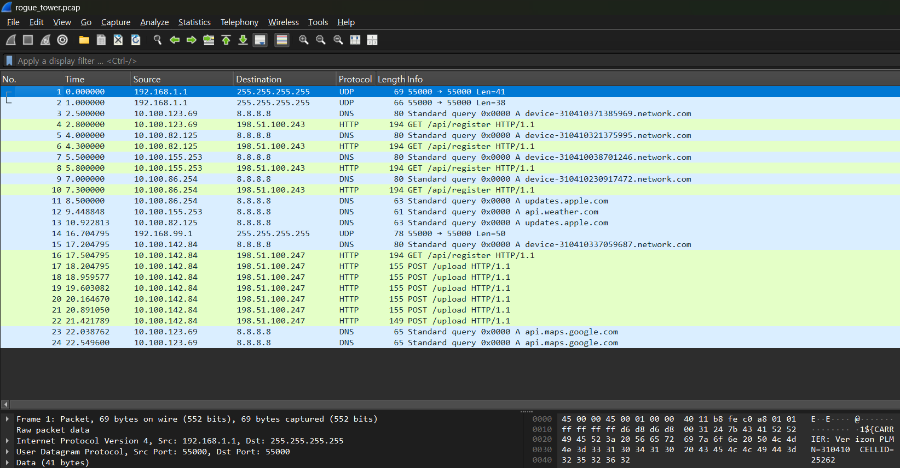

# Rogue Tower
Number of Points: 300

## Description
A suspicious cell tower has been detected in the network. Analyze the captured network traffic to identify the rogue tower, find the compromised device, and recover the exfiltrated flag. Download the network capture file: here

## Hints
* Look for unauthorized test network broadcasts on UDP port 55000
* Find the device that connected to the rogue tower by checking HTTP User-Agent headers
* The encryption key is derived from the victim device's IMSI
* The exfiltrated data is split across multiple HTTP POST requests

## Analysis
Opening the network capture file with Wireshark

because there are not that many packets, we could go through each one of them.

A few things however.
* Looking at UDP packets, they do not seem interesting except for packet no.14, where it contains data "UNAUTHORIZED-TEST-NETWORK"
    * This mentions CELLID=90461
    * This seems like a rogue network that we are looking for.
* Packet no.4, 6, 8, 10 seem like normal traffic.
* Packet no.16 is another register request, but it is followed by a bunch of POST request.
    * This packet contains information about the mobile device that is connecting to the rogue tower.
    * IMSI:310410337059687
    * CELL:90461
        * The CELLID of the rogue tower.
* Assembling the data from the POST requests into one, we get a base64 encoded string.
```
Q15TWnpifkxBB1dACmlbBF9bb0EJQQtFbAQBBQ1QXAEASg==
```
However this does not give a flag.

The hint says that an encryption key is derived from IMSI, meaning there is an encryption scheme that we have to find out, or guess.

### (Failed Attempts?)
I tried xoring the encrypted flag with MD5, SHA1, SHA2 hashes of the IMSI value in string form, but I did not get anywhere.

## Solution
I tried xoring the encrypted flag with IMSI directly.
```python
b'pocnKRM\x7fv7by<Ql'
```
Wait, it looks somewhat like a flag! It starts with four lowercase alphabets, followed by three uppercase alphabets,
then something weird!

Since I know that the flag starts with "picoCTF{", I xored the above with this,
```python
[0, 4, 7, 5, 12, 15, 14, 15]
```
The differences are very small!
Using this to adjust, I realized that in fact, it is the right idea, but we had to drop the first 6 bytes of IMSI!
Hence
```
imsi_key = str(imsi)[6:]
```

I then tried "Vigenere"-like cipher, and it turned to give me the flag.
```python
# xor = lambda xs, ys: bytes([x ^ y for x, y in zip(xs, ys)])
key = b"37059687"
print(xor(encr_flag, key+key+key+key+key))
```
