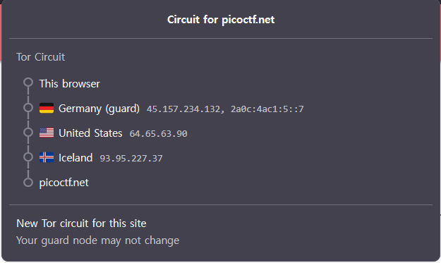

# North-South
Number of Points: 100

## Description
I've set up geo-based routing - can you outsmart it? You're trying to retrieve the flag, but there's a catch: access to the real service is restricted based on your geographic location. Only requests from a specific region are routed to the server that holds the flag. Everyone else is sent somewhere... less interesting.

Additional details will be available after launching your challenge instance.

## Hints
* How does a server figure out where in the world you're connecting from?
* Can you "travel" to another location without ever leaving your chair?

## Analysis
We are given an [Nginx configuration file](https://challenge-files.picoctf.net/c_lonely_island/33d90008595c73a3248e4989aad940e4b8f7611f4ddc942f44b65889151e851f/nginx.conf)

I do not know exactly how Nginx works, but looking at the configuration,
```
load_module /usr/lib/nginx/modules/ngx_http_geoip2_module.so;

worker_processes 1;
events { worker_connections 1024; }

http {
    include       mime.types;
    default_type  application/octet-stream;

    geoip2 /etc/nginx/GeoLite2-Country.mmdb {
        auto_reload 5m;
        $geoip2_data_country_code default=ZZ country iso_code;
    }

    upstream north {
        server 127.0.0.1:8000;
    }

    upstream south {
        server 127.0.0.1:9000;
    }

    server {
        listen 80;

        location / {
            if ($geoip2_data_country_code = IS) {
                proxy_pass http://south;
            }

            proxy_pass http://north;
        }
    }
}
```
it seems like the server returns "south" page when the IP of my machine is from Iceland (Country code: IS) and "north" page otherwise.

## Solution
None of my team members had paid VPN subscriptions.

Also, finding a free proxy server for Iceland that was actually functional was a challenge.

I tried using Tor Browser, but obviously the nodes were randomized so it was difficult to get the exit node to Iceland, or any node to Iceland for that matter, because that only happened once to me. **But this confirmed that Iceland exists as a Tor node**.

What I ended up doing was using Tor Browser with the exit node set to Iceland, so that every connection would come out of Iceland.

You can do this by modifying `torrc` file by adding `ExitNodes`.
```
ExitNodes {is} StrictNodes 1
```

Then without using a paid VPN service, you can spoof your IP to be from Iceland.

