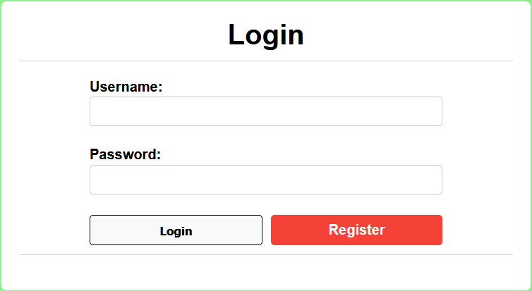
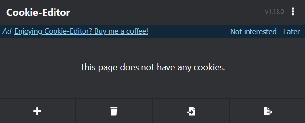
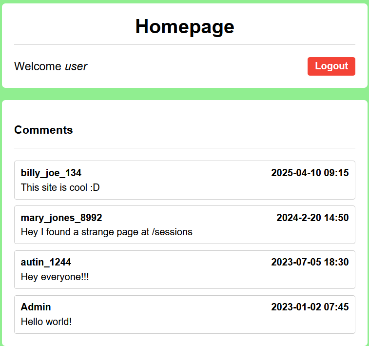
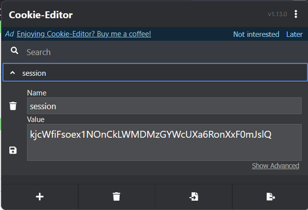
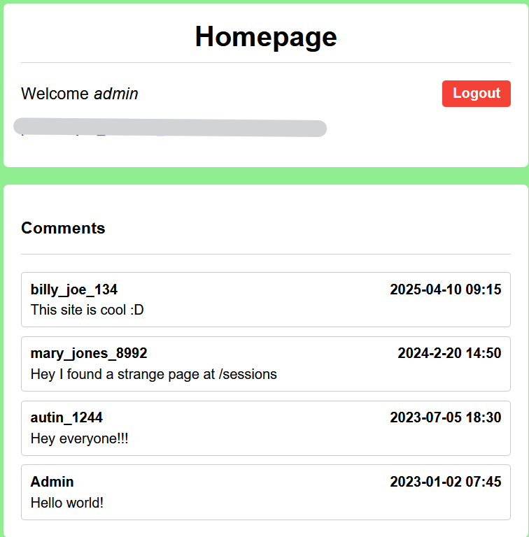

# Old Sessions
Number of Points: 100

## Description
Proper session timeout controls are critical for securing user accounts. If a user logs in on a public or shared computer but doesn’t explicitly log out (instead simply closing the browser tab), and session expiration dates are misconfigured, the session may remain active indefinitely. This then allows an attacker using the same browser later to access the user’s account without needing credentials, exploiting the fact that sessions never expire and remain authenticated. Your friend tells you to check out a new social media platform he built a few years ago. Although its still under development, he said the site is almost complete. He also mentioned that he hates constantly logging into sites, and so has made his page that 'once you login, you never have to log-out again'! Browse here, and find the flag!

## Hints
* Do you know how to use the web inspector?
* Where are cookies stored?

## Analysis & Solution
The web page looks like a standard login page.



Using [Cookie-Editor](https://cookie-editor.com/) browser extension, I see no unusual cookies set for sessions.



I decided to register as a normal user and see if there is anything with cookies.

I registered as `user:pass` and signed in.



Looking at Cookie-Editor again, I was given a session cookie.



One of the comments says there may be something interesting at `/sessions`, which is fortunate,
as we would have had to use `dirb` or `gobuster` or some tool to guess the name if this was provided.
I navigated to the page and:
```
1) session:vdPHYDbLQmX7M3G4pSE1gTgg-V1jGelI_6rTI0z1eJ0, {'_permanent': True, 'key': 'admin'}

2) session:kjcWfiFsoex1NOnCkLWMDMzGYWcUXa6RonXxF0mJslQ, {'_permanent': True, 'key': 'user'}
```
Note that my session cookie is shown in the second row.

I could overwrite my cookie with the admin cookie on Cookie-Editor, but refreshing `/sessions` did nothing.

I went back to the home page, and that is where I was greeted with a flag.



## Post-Analysis Notes
This vulnerability is known as **session hijacking**.

Note that if admin logs out (whether that is you or the actual admin), the session becomes invalidated.
