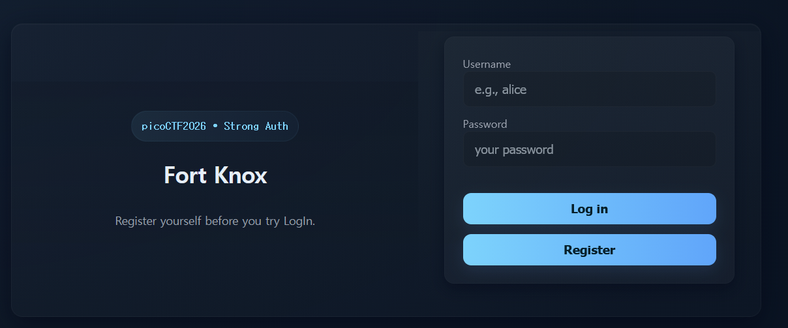
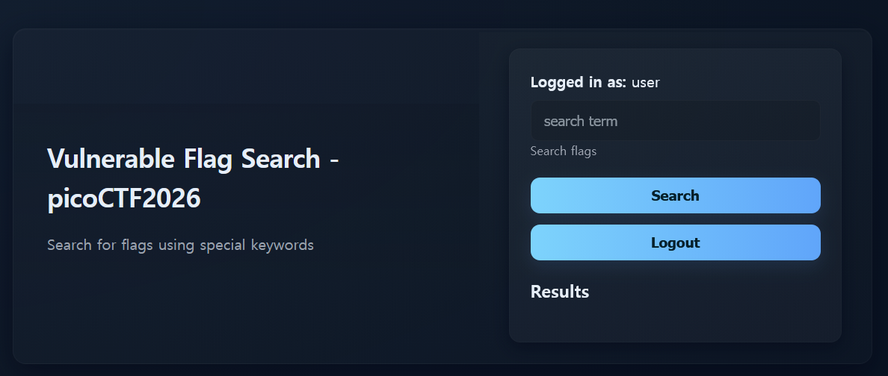
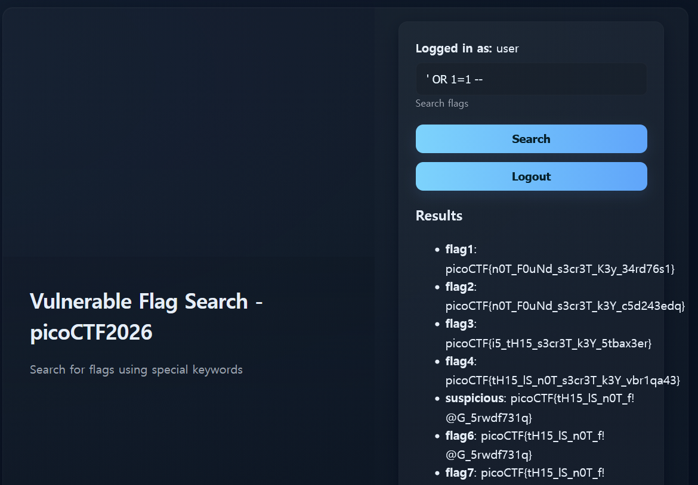
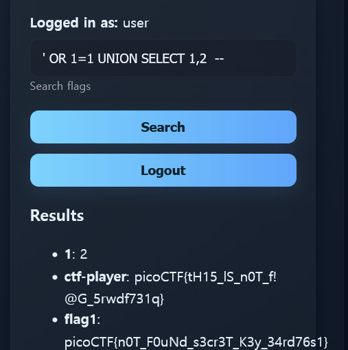

# Sql Map1
Number of Points: 300

## Description
You’ve been hired by a shadowy group of pentesters who love a good puzzle. The system looks ordinary, but appearances lie. Somewhere inside, sloppy code and legacy hashing practices left a tiny, perfect doorway for an attacker. Your mission — should you choose to accept it — is to slip through that doorway, act as a legit user and retrieve the secret flag.

Additional details will be available after launching your challenge instance.

## Hints
* Search box looks interesting.
* Passwords should not be stored in md5 format.
* CrackStation is a great online tool for cracking hashes.
* `sqlmap -u <URL_for_search> --cookie="PHPSESSID=1111111111111" -p <vulnerable_parameter> --batch --tables`

## Analysis & Solution
(I've solved this without sqlmap, though it probably makes things easier.
For learning purposes, I personally like to do this manually.)

When I navigated to the site, I was greeted with a sign in page.

I've tried queries and SQL injections to see if I can enumerate users or do some sort of authentication bypass,
but it did not work.

Just like the login page says ("Register yourself before you try Login"),
I decided to register as "user:pass" and sign in with that credential.


Now that there is a search page, I attempted SQL injection.


We confirm that this search box is **vulnerable to SQL injection**.
Unfortunately, none of the flags worked.

It seems like we have to enumerate the database.
First of all we need to check what kind of database this is.

To do so, it is helpful to first be able to "UNION" multiple tables.


This confirms that there are **two columns**.
I tried asking for version by `@@version` which is a directive usually for MySQL.
```
Warning: SQLite3::query(): Unable to prepare statement: 1, unrecognized token: "@" in /var/www/html/vuln.php on line 39

Fatal error: Uncaught Error: Call to a member function fetchArray() on bool in /var/www/html/vuln.php:40 Stack trace: #0 {main} thrown in /var/www/html/vuln.php on line 40
```

This confirms that this database is **SQLite3**.

Attempting the following query to enumerate the names of the table,
```sql
' OR 1=1 UNION SELECT name,2 FROM sqlite_master WHERE type = 'table' --
```
we get the following key values of which the values associated are `2`.
* flags
* sqlite_sequence
* users

It seems like `flags` is the table that might be being shown here.
I could try to get information from `users` table by enumerating the column names.

```sql
' OR 1=1 UNION SELECT name,2 FROM PRAGMA_TABLE_INFO('users') --
```
The column names were found to be
* id
* username
* password

Finally trying to enumerate username and password
```sql
' OR 1=1 UNION SELECT username, password FROM users --
```
there were several MD5 hashes, so using [CrackStation](https://crackstation.net/) and attempting to crack any of them,
I found that `ctf-player:dyesebel` is a valid credential.

Signing in with that credential gives you the flag.
